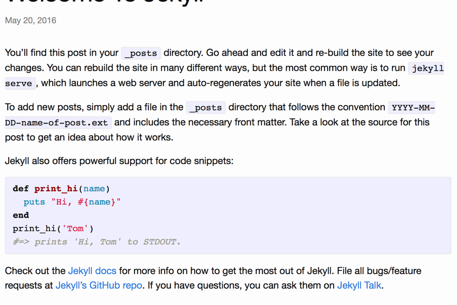

# WowStack: Hugo Minima theme [![Build status][bs-image]][bs-url]

This is the primary theme used for all [WowStack][wowstack] websites to keep
people informed about the projects' progress in restoring [WoW][warcraft] to
its' former glory.



## About this repository

This is a [Hugo][hugo] theme, ported from the beautiful [Minima][hugo-minima]
default theme for Jekyll.

It mainly has some amounts of styles being built in the [build system][bs-url].

### Setting up the needed secrets for Drone 0.7

Slack notification settings:

```bash
drone secret add --repository wowstack/hugo-minima --image plugins/slack --name slack_webhook --value "WEBHOOK_URL"
drone secret add --repository wowstack/hugo-minima --image plugins/slack --name slack_channel --value "CHANNEL_NAME"
```

[bs-image]: https://build01.kogitoapp.com/api/badges/wowstack/hugo-minima/status.svg
[bs-url]: https://build01.kogitoapp.com/wowstack/hugo-minima
[project-image]: .gitea/wowstack-project.png "WowStack project"

[wowstack]: https://wowstack.io/ "WowStack project"
[hugo]: http://gohugo.io/
[hugo-minima]: https://github.com/jekyll/minima
